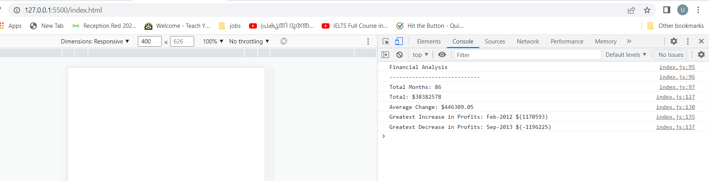

# Unit 4 Challenge: Console Finances

## Overview
 
In this challenge, you'll be using the concepts you've learned to complete the required activity. This activity presents a real-world situation in which your newfound JavaScript skills will come in handy. You are tasked with creating code for analyzing the financial records of a company. You have been provided with a financial dataset in the `starter/index.js` file.

### Screenshots

Financial analysis

## Submissions

* The URL of the deployed application.
https://umaparu.github.io/Console-Finances/

* The URL of the GitHub repository that contains your code. Give the repository a unique name and include a README file that describes the project.
https://github.com/umaparu/Console-Finances

---

## Copyright

© 2022 edX Boot Camps LLC. Confidential and Proprietary. All Rights Reserved.

